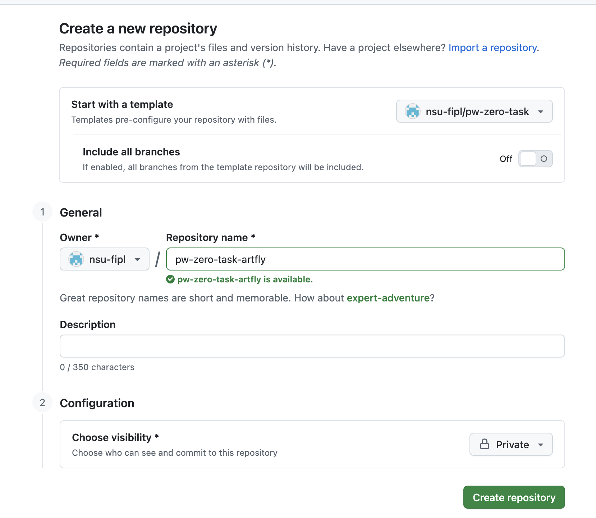

# Задание 0. 

## Описание

Вы - подающий большие надежды стартапер (фото ниже).
Вы решаете, что вам СРОЧНО необходимо сделать новый сервис - сервис, который позволит определить, куда пойти с девушкой (парнем) на следующее свидание.

## Регистрация

1. Если вы еще не зарегистрировались на гитхабе - сделайте это (не знаете как - спросите препода!)
2. В тг поговрите с ботом @fipl_grader_bot . Отправьте ему логин на гитхабе, с которым вы регистрировались
3. После того как проделаете все описанные ниже действия, запишите все гитовские команды в файл `commands.txt` отдельным коммитом (в тг вам придет уведомление, прошли ли тесты)

**ВНИМАНИЕ!** Настоятельно рекоммендуется писать ваши команды сразу в отдельный текстовый файл, чтобы потом ничего не потерять

## Задание

#### 0.0. Мечтают ли андроиды об электроовцах?

1. Нажмите кнопку зеленую кнопку "Use this template" -> "Create new Repository" справа сверху
2. В новом окне выберите параметры:
   * `Owner` - nsu-fipl (если такого нет, то вы не состоите в организации, попросите препода вас добавить)
   * `Repository name` - pw-zero-task-ВАШ_НИК_НА_ГИТХАБЕ
   * `Choose visibility ` - private
   * остальные нам не важны, оставляем как есть  
  
После того, как убедились, что все верно, нажимаем `Create Repository`.
  
Пример заполнения для ника `artfly`:

3. Теперь нужно склонировать созданный репозиторий, его имя можно посмотреть нажав зеленую кнопку `Code` и выбрав там `https`. После этого делаем `git clone ИМЯ_РЕПОЗИТОРИЯ`. Кстати, это наша первая гитовская команда, не забудьте ее сохранить для отправки вашего ответа!

#### 0.1. Ресторан в конце Вселенной

1. В ветке `master` создайте файл `date.py`. Напишите в нем список возможных кафе и ресторанов для посещения
2. Закоммитайте список ресторанов, в сообщении напишите `Available places`
3. Запушьте изменения

#### 0.2. Который из трех?

1. Создайте ветку `feature/choose_places`. Напишите в ней в файле `date.py` функцию `choose_place`. Функция должна печатать на экран одно из мест из списка
2. Закоммитайте и отправьте на гитхаб изменения с сообщением `added choose_places()`
3. Добавьте еще один коммит - он должен содержать дополнительные доступные места (по вашему усмотрению). Сообщение для коммита - `more available places`
4. Добавьте еще один коммит - он должен содержать функцию, которая печатает сколько вам лет (сообщение - `годы летят`). Запушьте оба коммита
5. А, ой... Вы поняли, что такую информацию стоит показывать преподавателю не раньше третьей совместной пары. Откатите ваш коммит, воспользовавшись `git reset --hard` (используйте синтаксис с `HEAD~`)
6. Теперь изменение нужно форс пушнуть

#### 0.3. Двойник

1. Внезапно все кафе начались переназываться по-русски (вот это поворот)... Перейдите в ветку `master`
2. Переназовите все рестораны и кафе по-русски!
3. Запушьте изменения, в коммите напишите `Я не умею жить по-другому`

#### 0.4. Война и мир

1. Прежде чем замерджить свои изменения в `master` вам нужно заребейзиться на его свежую версию. Перейдите в ветку `feature/choose_places`
2. Сделайте ребейз на `master`. В процессе у вас будут конфликты, разрешите их
3. Запушьте новое состояние ветки с `force`'ом

#### 0.5. О дивный новый мир

1. Осталось немного! Перейдите на `master` и замерджите изменения из ветки `feature/choose_places`
2. Отправьте свои изменения

## Что мы сделали

Мы сейчас вспроизвели один из стандартных `workflow` при работе с кодом в гите:

- Есть основная ветка - туда все разработчики заливают свои изменения (у нас это был `master`)
- Есть отдельные ветки, которые используют разработчики - вам нужно сделать новый функционал, 
вы берете текущее состояние `master` и начинаете от него "писать" свои изменения (у нас это ветка `feature/choose_places`)
- После того как вы допишите свои изменения, вам нужно влить их в `master`. Но может произойти так, что `master` уже был кем-то отредактирован. Если это так, то у вас возникают конфликты
- Одна из политик - просто замерджить вашу ветку в `master` "как есть", а если есть какие-то конфликты, то исправлять их в отдельном коммите, который образуется при мердже. 
- У этого подхода есть плюсы - по истории понятно, откуда взялись изменения. Но есть и недостаки - образуются "мусорные" мердж коммиты, которые полезной информации не содержат
- Другая политика, которую мы использовали - сначала обновить нашу ветку до текущего состояния `master` и только потом попытаться включить изменения в `master`. Для этого мы делали ребейз нашей ветки на мастер. По сути это и есть наша задача - получить ветку, которая будто бы была только что создана от мастера и включает все изменения из него
- В процессе ребейза на `master` мы можем получить конфликты - нужно будет отредактировать наши уже сделанные изменения на основе того, что добавили в мастер. Может быть мы и обойдемся без конфликтов - если другие разработчики не трогали те же файлы, что и мы
- После того как мы обновили нашу ветку ее нужно отправить с force'ом, поскольку мы редактировали историю. Ну а в мастер эти изменения мы можем уже просто взять с помощью мерджа

## Полезные команды

* `git reset HEAD~` - откатиться на один коммит назад с сохранением файлов (локально)
* `git reset --hard HEAD~` - откатиться на один коммит назад с удалением файлов (локально)
* `git reset --hard origin/master` - удалить все локальные изменения и откатиться к последнему известному состоянию ремоут ветки `master`
* `git push` - отправить изменения
* `git pull` - скачать изменения и применить на текущей ветке (если есть локальные изменения, то по умолчанию делается мердж с ними)
* `git rebase branch` - сделать ребейз на ветку `branch`
* `git status` - посмотреть текущее состояние веток и файлов

## Как запускать тесты локальны и смотреть их результаты
* `pip install pytest`
* `python -m pytest tests/` - запускать из вашей папки-репозитория
